# india

[pixnet 恆河聖城─瓦拉納西(varanasi)](http://m250275a.pixnet.net/blog/post/168004971-%5B%E5%8D%B0%E5%BA%A6%E6%97%A5%E8%A8%98%5D-%E6%81%86%E6%B2%B3%E8%81%96%E5%9F%8E%E2%94%80%E7%93%A6%E6%8B%89%E7%B4%8D%E8%A5%BF(varanasi))
    
```
注意事項：
       不要隨便與人握手！會強迫按摩，並收費。
       準備許多民宿口袋名單。部落格主找到第三家才有空房住。
住宿：
       Hotel Sonmnuy
交通：
飲食：
       日式咖哩飯 XD Shanti Restaurant - 充滿外國觀光客。點餐一個小時後才上菜。QQ
參觀焦點：
       達薩斯瓦梅朵河壇
       Puja 儀式，印度教裡向眾神祭拜及獻禮的儀式。
       瓦拉納西大街
       可搭船，參觀對面沙洲。從對面沙洲可看到河壇舉行火葬。
       可以看日出，但似乎要跟船家前一天約好時間，跟他講住哪間民宿他就知道到哪個河壇接。
```

[【最真实的印度vlog】Day25-污秽的瓦拉纳西和不神圣的恒河夜祭](https://www.youtube.com/watch?v=a6TJKXBAlBw)

```
00:00 ~ 04:54
1. 睡不好，折騰。
2. 拍攝車廂內部。
3. 火車會經過恆河。

04:54 ~ 10:00
1. 火車站月台有牛在跑
2. 車站有英文廣播
3. 會有 tutu 司機前來搭訕， 兩人 80 盧比到恆河
4. kumiko house 80 盧比直接搭車，不討價還價。
5. 被印度人搭訕拍照。
6. 出站後，看到許多 tutu 覺得被貴了。但還是搭了。
7. 司機介紹瓦拉納西歷史，看起來似乎友善。

10:00 ~ 15:00
1. 到中途， tutu 司機換人，don't know why.
2. 新司機開到一半突然下車，拍片者說：「他媽的，又去拉人」。猜測可能要跟其他人併車？是的沒錯，駕駛座，坐了三個人。
   似乎是三個人湊錢買一輛車，輪流著開。
3. 女伴問拍攝者以前坐 tutu 經驗就如第二點那樣？拍攝者說他以前都是直接走過去的。
4. 沿途可看見瓦拉納西街道。
5. 小巷子裡，蒼蠅爆多。有羊、牛。猜測這一段可能是司機帶他們走向旅館？小巷極其骯髒。

15:00 ~ 20:00
1. 再次強調巷子髒。很擠，機車也跟著擠在一起。都是大便。
2. 到達久美子之家。印度大媽還能打赤腳踩大便。爛拖鞋已經算條件好了。
3. 聽兩人討論，從久美子之家似乎步行就可以到河邊了。
4. 遊客挺多，久美子之家巷子口出來，往右邊看，冒煙處似乎就是火葬處。

20:00 ~ 25:00
1. 拍攝了河岸，兩人閒聊。
2. 夜祭，有很多老外。
3. 似乎把外國面孔當作是吉祥物，還有人帶著孩子要跟女主拍照。
4. 自拍時，熱心當地民眾協助拍攝。
5. 夜祭的 bgm 很攝心。

25:00 ~ 35:00
1. 夜祭儀式，觀賞人數眾多。
2. 夜晚蚊蟲似乎很多。
3. 結束後會分發類似「加持過的聖果」？
4. 路邊垃圾有夠多，路邊很多牛。
5. 晚上巷弄人似乎很多。感覺安全。

注意事項：
住宿：kumiko house (https://www.facebook.com/notes/%E4%B8%96%E7%95%8C%E9%80%B2%E8%A1%8C%E4%B8%AD-the-ongoing-world/%E5%8D%B0%E5%BA%A6%E9%82%A3%E5%80%8B%E5%86%AC%E5%A4%A9%E9%82%A3%E4%BA%9B%E6%B2%92%E6%9C%89%E7%86%B1%E6%B0%B4%E7%9A%84%E5%8D%B0%E5%BA%A6%E6%97%85%E7%A4%BE/1015432245187132/)
交通：
飲食：
參觀焦點：
```

[【最真实的印度vlog】Day26-恒河水浪打浪 焚尸场中尸连尸](https://youtu.be/FgCoJRhckaQ?t=20m)
```
00:00 ~ 05:00
1. 談論在印度做生意「賣拖鞋」。
2. 去金廟看看
3. 賣零食小吃的店，裡面聚集很多蜜蜂！好在不是蒼蠅。
4. 經過做酸奶的地方？不是！

05:00 ~ 10:49
1. 看見印度人妖，火車上搜首弄姿，接著跟你要錢。
2. 路邊牛挺溫順。路邊三輪車司機問要不要搭車。腳踏車司機都特別可怕（男主說）。
3. 逛市集，masala, 首飾。
4. 出現警察，但不知發生什麼事。
5. 路邊問路，問 gate number 2 在哪。

10:49 ~ 15:44
1. 前往 golden temple, gate number 2.
2. 進入需要看護照。
3. 要脫鞋，金廟不讓帶行李，更不讓拍照。
4. 用手機，印度人亂入。

15:44 ~ 20:00
1. 罵牛，老老實實待著都不行
2. 可以坐船 (似乎又回到恆河邊了，祭壇邊)
3. 罵印度人，火葬場，似乎欺負外國人，要看就得給錢。
4. 船夫開價一小時兩百盧比。
5. 猜測到了最大的碼頭
6. 遇到了傳說中要握手的流氓XD，握著手一直按摩還說不用錢。

20:00 ~ 26:00
1. 討論要餵牛吃啥。吃香蕉皮。
2. 看見兩牛在玩耍。牛尿尿。
3. 看見苦行僧。
4. 欣賞建築。
5. 船夫問要不要坐船，very cheap price 呢！
6. 兩人坐船包船 500。與他人組團 150 per person。

26:00 ~ 30:00
1. 聽到組團坐船只要三百。（真是怪了，價錢一直變。XD)
2. 後悔拖鞋進去。(金廟？)
3. 可坐到對岸沙洲再回來，中途可以看火葬。(兩人四百塊，後來降到 300，最後又降到 200。)
   (船夫說其他人都開 8,900) 後來決定搭了！

30:00 ~ 35:00
1. 準備上船，要做前面，後面船夫要划船。
2. 對面沙洲無房子，因為汛期來時，會淹沒（大約七月）。
3. 背景音樂好聽！
4. 滑到沙洲了，船夫交代不可以待太久。
5. 疑似看到火葬場。

35:00 ~ 40:00
1. 沙洲沿岸還是很髒。
2. 疑似看到屍體殘骸。
3. 看到一個廟，男主講述上回爬上去過，看到許多老太太似乎在裡面等生命結束。
4. 沿岸有很多小廟。
5. 女主問船主，七月這些小廟都會被水淹沒嗎？船主：YES!

40:00 ~ 45:00
1. 划至岸邊，船遊結束，準備給錢。兩百盧比。
2. 男主問女主是否去看火葬場，女主有點慌。火葬場不許拍照，只能看，但空氣很香。
3. 後面遇到路邊印度人搭訕。讓跟印度小孩拍一張照，一百盧比。(有病嗎？)
   男主不拍，後來還隨便男主開價。（小孩想跟男女主拍照，旁邊的大人看到，就要敲竹槓。）
4. 後來跟小孩拍。小孩不拿錢。
5. 男主說小孩子都蠻好。男主問怎麼回去久美子之家，小孩似乎還幫忙報路。

45:00 ~ 50:00
1. 小朋友踢拖鞋遊戲。
2. 路邊買花生，一點點，20 盧比。(小孩一直偷吃攤販花生 XD)
3. 女主想坐孩子中間拍個照。
4. 恆河邊玩風箏。鬥風箏！！！好兇啊！

50:00 ~ 55:53
1. 男主到印度理髮店，男生剃頭八十盧比。
2. 住宿地方出現很多壁虎。又大又肥。

```

[【印度vlog】Day27-恒河里没有浮尸，有的是活死人](https://www.youtube.com/watch?v=iCGe6BRRIg8)

```
00:00 ~ 05:00
1. 看恆河日出。跟當地人打招呼，似乎有與當地人安排日出行程
2. 搭船看日出。
3. 與昨天的船夫相遇，結果被嗆「你昨天唬爛我說沒有要看日出。」
4. 許多人在恆河邊沐浴。
5. 經過濕婆金廟。

05:00 ~ 10:00
1. 女主相機用 Nikon
2. 經過練瑜伽的地方，小孩喊叫、大笑
3. 擔心霧太大看不到日出
4. 這邊洗衣服都是男的洗
5. 似乎看到火葬場，不能拍照。窮人用電力火化，免費的。富人用木頭燒，五六千盧比一個人。
6. 恆河邊有很多濕婆神廟，瓦拉納西是濕婆神的地盤。

10:00 ~ 15:00
1. 恆河有魚＠＠
2. 火葬場每天平均火化 120 遺體。24 小時火化。
3. 太陽清楚一點了
4. 船夫推薦瓦拉納希恆河夜祭。everyday 6 oclock，大概一千人左右參加
5. 船夫幫忙夫婦拍照。

15:00 ~ 20:00
1. 背景音樂很好聽！攝心！Concerto No. 4 in F minor, Op. 8, RV 297, "L'inverno" (Winter): II. Largo
2. 印度人洗衣服用甩的！就在一堆垃圾旁邊洗衣服＠＠
3. 洗完直接曬在泥地上？！＠＠
4. 奇妙的羊。喉嚨下面還長兩個耳朵？
5. 經過濕婆神廟，廟前有個小池塘！

20:00 ~ 25:00
1. 在岸上看人家洗澡
2. 一盞水燈，十盧比。
3. 岸邊石階上還有雕刻

25:00 ~ 30:00
1. 羊偷咬男主的背包
2. 男主幫女主畫手彩繪藝術
3. 河岸小孩玩板球
4. 印度老人給名片，請幫介紹客人（但不知道是什麼店！是久美子的家！
5. 路上遇到牛打噴嚏XD

30:00 ~ 35:00
1. 女主表示待久了其實不討厭了。覺得印度人還是不壞的。男主表示：也不是壞，但就是討厭。
2. 男主表示，每天到同一個地方，感覺都不一樣。
3. 路邊攤橘子 一公斤 50 盧比。
4. 準備去搭火車，搭 AC (Air Conditioner) 車廂 
5. 男主想直接搭三輪車去車站。

35:00 ~ 40:00
1. 詢問路邊司機到火車站多少錢，司機開價 400 盧比。男主說，把我們當做臭傻B囉。
   女主說，我們之前做過來才八十盧比。
   後來司機再降價至 200 盧比。男主決定不甩他們。
2. 男主停下買零食（芒果膏），後來覺得有點貴，就不買了。
   後來在另一攤看到更便宜的就買了。
   女主說這裡一般來說小零嘴都是五盧比左右
3. 三輪車司機一開始說 100 盧比，後來說 120 盧比，最後殺價 20 但失敗。
4. 中飯吃了四百多。零錢要多放一點。

40:00 ~ 45:00
1. 司機騎的過程一直說路很難騎，這下肯定要一百二盧比了。
2. 女主覺得司機踩的辛苦，覺得給他兩百也行。
3. 路況真的不是很好，看到對面車道，一個旅行團搭三輪車過來。
4. 路上有兩隻牛在鬥。

45:00 ~ 50:00
1. 路上喇吧真是狂按。
2. 三輪車司機真的蠻辛苦。
3. 遇到塞車，男女主表示要提早下車走路到目的地。給錢但司機無法找開。切記到印度要換很多小鈔。
4. 結果司機幫忙跟路邊攤販換小鈔。司機該找五十元，他有錢可以找，但想凹男女主。最後還是找 50 元。

50:00 ~ 55:00
1. 男主猜測，如果是印度本地人搭車可能一百盧比都不用。
2. 遇到小孩來乞討，一直纏一直纏。
3. 到了瓦拉納希火車站。
4. 拍攝火車時刻表，或許可參考。他們是認車號 21108。Train Name 是印度文。
5. 進入車站詢問 D8 月台怎麼走。感覺有點難找。

55:00 ~ 1:02:24
1. 擔心火車早走（我覺得他們想太多
2. 又再問了一次怎麼走到 D8 月台 B2 車廂，最後找到，且火車似乎準點到！@@
3. 找得很緊張，捏一把冷汗，這個車廂都是老外較多。
4. 男主看到車廂都是老外，說了一句「感覺好安全喔！」
```

[【印度vlog】Day31-抱歉，我们明目张胆地偷拍了泰姬陵的内殿【Taj Mahal Inside view】](https://www.youtube.com/watch?v=VvpaeCrRQEQ)
```
00:00 ~ 05:00
1. 到泰姬瑪哈陵附近，就有人告訴你該往哪邊買票，以及進入泰姬瑪哈陵相關規定。(大包包不能帶進去，小的可以)
   最後問你需不需要導遊 XDDDD
2. 買票窗口有兩種，印度本地人與外國旅客。
3. 一大早就很多人進去參觀了。

05:00 ~ 10:00
1. 很多中國旅遊團，男主說連他們自己也怕。
2. 欣賞泰姬瑪哈陵外面花園，真的挺漂亮的。
3. 有些地方要穿鞋套才可以上去。

10:00 ~ 15:00
1. 印度人走裡面圈，外國遊客走外面圈。but don't know why.
2. 大理石地板真的很漂亮。
3. 胡馬雍陵為藍本建成。

15:00 ~ 20:00
1. 有人講內殿不能拍照。
2. 結果他們給人家拍內殿。
3. 大理石雕刻內部比外面還精細
4. 雖然禁止拍照，但似乎都沒人管，大家都拼命拍。

20:00 ~ 25:00
1. 內部各種精美大理石雕拍攝。
2. 部分大理石還是有污垢，難以清理。
3. 男主表示：那麼大規模，那麼精緻的細節。

25:00 ~ 30:00
1. 女主拍可愛印度小孩。
2. 跟印度人要 email，可能是想要寄照片給他們吧？
3. 男主表示在泰姬瑪哈陵感覺很舒服。
4. 女主表示，不虛此行！

30:00 ~ 35:00
1. 胡馬雍陵就是泰姬瑪哈的原型，只是小很多，在德里。
2. 印度人找他們一起拍照。
3. 赤腳踩大理石地板，超冰！
4. 講到底層人民非常友善。

35:00 ~ 40:00
1. 太好拍，拍到一顆電池都快沒電了。
2. 男主表示很捨不得走。
3. 先前合照的印度人有 email 了，女主將照片寄給他們。並邀請小孩們拍更多照片。
4. 小姑娘紗麗非常漂亮

40:00 ~ 45:00
1. 鞋套都穿破了
2. 背景音樂配上景點影片。
3. 泰姬瑪哈陵對面的暗紅色建築物超漂亮。
4. 前面的塔樓正在清洗，男主問能不能爬上去，被拒絕
5. 試圖行賄爬上去，印度人拒絕XD

45:00 ~ 50:00
1. 男主發現，來泰姬瑪哈陵，許多小姑娘紗麗都穿得特別漂亮、隆重。
2. 印度人特別喜歡跟外國人拍照。why?
3. 見到日本旅遊團。
4. 女主又被攔住拍照了。
5. 男主表示印度人膽子小，一兇他們就懦了。

50:00 ~ 55:00
1. 男主問警察（守著泰姬瑪哈陵），他們肚子餓了，可否在外面吃個東西後，再度進入？警察答：ok, no problem.
2. 走在路上有印度人推銷紀念品。
3. 找到了泰姬瑪哈陵附近的餐廳用餐。
4. 似乎在餐廳換了很多 10 元小鈔。
5. 再度進入泰姬瑪哈陵。

55:00 ~ 1:00:00
1. 欲再次進入泰姬瑪哈陵，被攔截問票。經解釋後放行，似乎還讓他們插隊。
2. 還需安檢一次。
3. 賓館的人說這只能進入一次，不知道為何這次可以重複進入。
4. 遇到學校學生郊遊，再次被要求要合照。
5. 再次進入時間是下午兩點多，人很多！要早上去！

1:00:00 ~ 1:02:31
1. 下午泰姬瑪哈陵人真的超多！
2. 在建築物外面走走繞繞。

```
[【印度vlog】Day32.i-我们在阿格拉堡解开了印度婴儿烟熏妆之谜](https://www.youtube.com/watch?v=VKMaAkcbfSg)

```
00:00 ~ 05:00
1. 搭嘟嘟車前往阿格拉堡
2. 超多人，是個大景點。
3. 路邊有人問要不要請導遊。
4. 外面有很寬的護城河，輸滿水位應該很壯觀。
5. 似乎找不到賣票的地方。很壯觀！（結論，導遊說當天免費！）
6. 和德里紅堡齊名
```

[跟我們一起搭印度火車 ❚ 超級旅行者](https://www.youtube.com/watch?v=R2960bmc5kE)

```
注意事項：
       1. 背包記得用袋子全包起來，火車髒。
       2. 座位有分等級。
       3. 要時時查看時刻表，因為火車可能換月台。
       4. 南印廁所乾淨到不可思議。南印人民水準高，較不會讓人覺得不舒服。

```

[Scrumptious INDIAN STREET FOOD Tour + SARNATH, The BIRTHPLACE of BUDDHISM | Varanasi, India](https://www.youtube.com/watch?v=Ez0Mh6nfmGc)

```
00:00 ~ 02:53

1. 看日出 (a must do) ，以及準備 food tour。
2. breakfast (印度人騎機車帶男主出遊)
3. 02:41 food #1 Malai
```
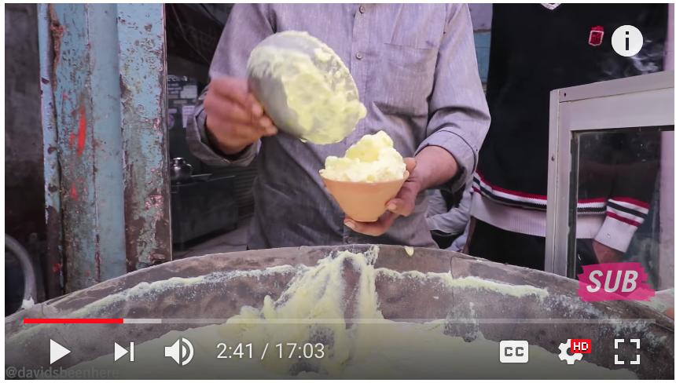
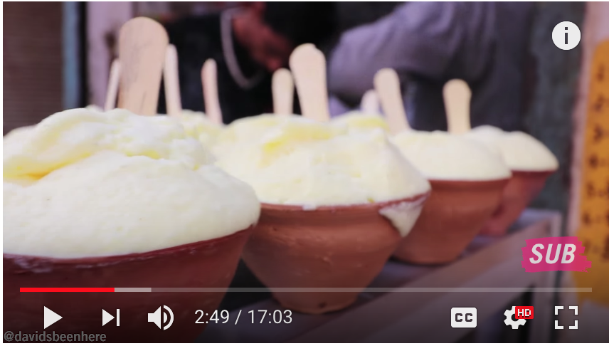

```
02:53 ~ 04:40
食物：Puri Kachori
```

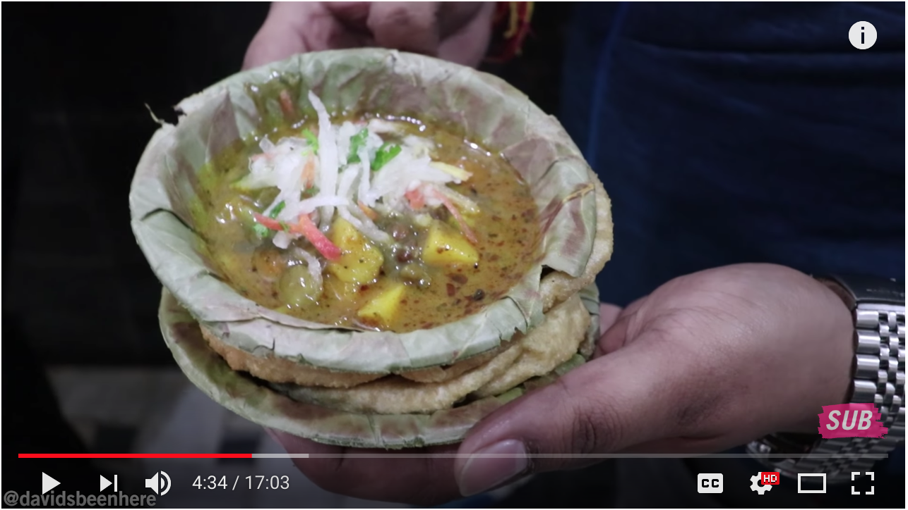
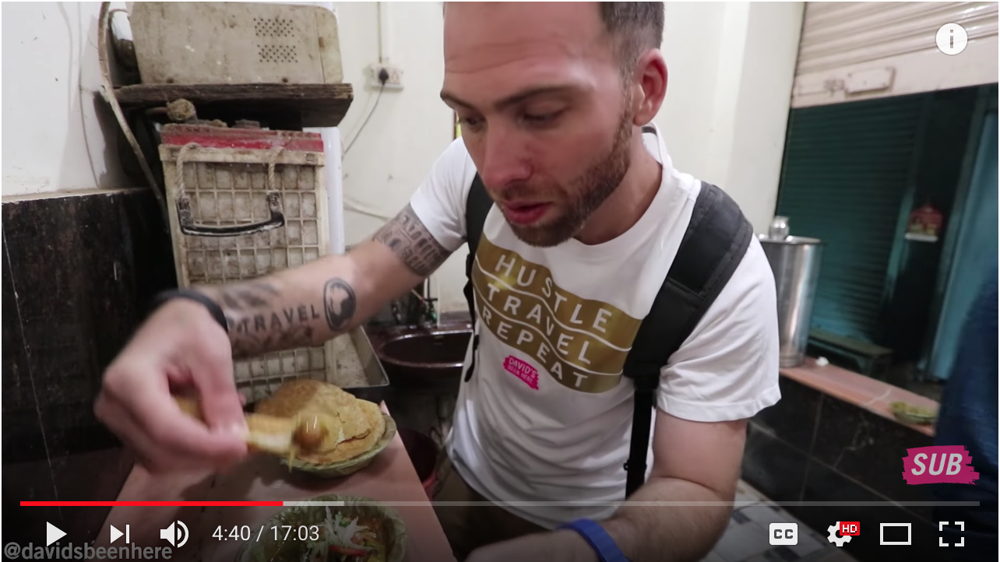

```
04:40 ~ 05:29
食物：jalebi
```
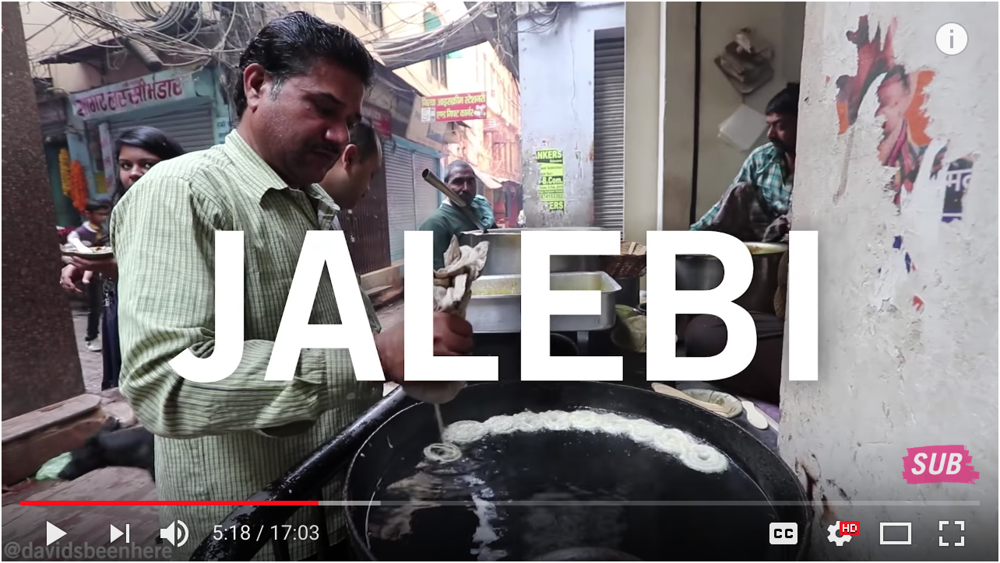
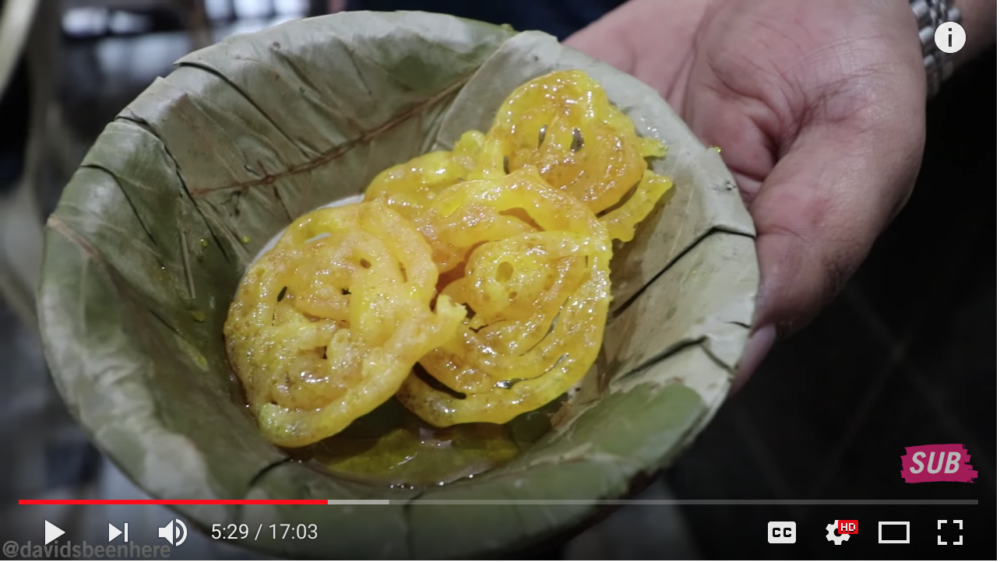

```
05:29 ~ 06:17
食物：Paan
```
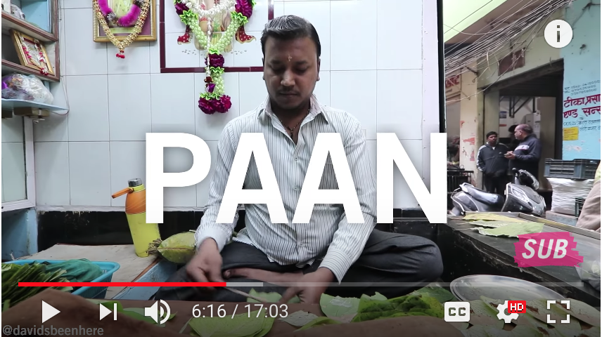
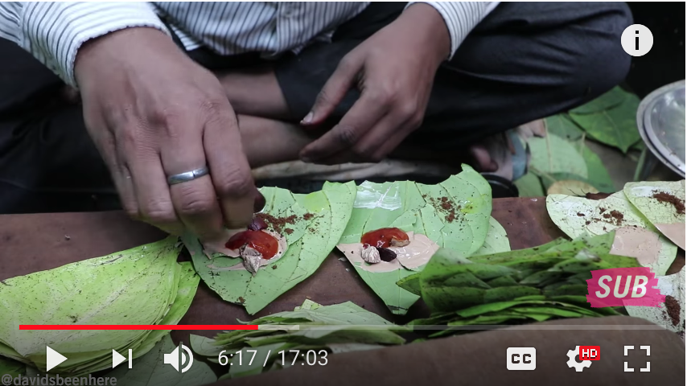


```
06:17 ~ 11:17
1. 到鹿野苑，佛教聖地。
2. 離瓦拉納西約十公里。
3. 是釋迦摩尼佛第一次講道之處。
4. 是個很乾淨很莊嚴的地方。
5. 導覽感覺非常專業。
```

```
11:17 ~ 15:05

1. 12:06 這尊佛是泰國政府捐贈的。
2. 作者說，去瓦拉納西後，若對佛教有興趣，鹿野苑大概是一個小時路程，可以去看看。
3. 食物：golgappas
```


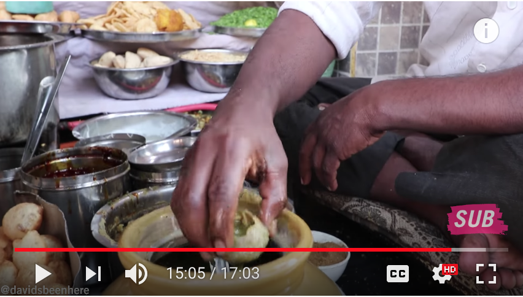

```
15:05 ~ 15:39
食物：Aloo Tikki
```
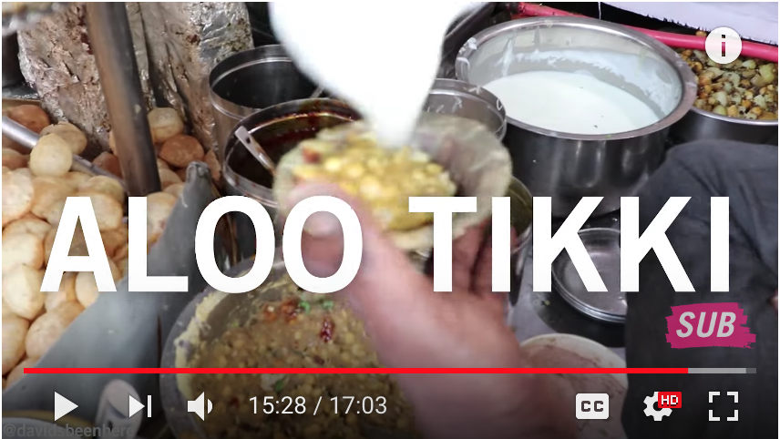
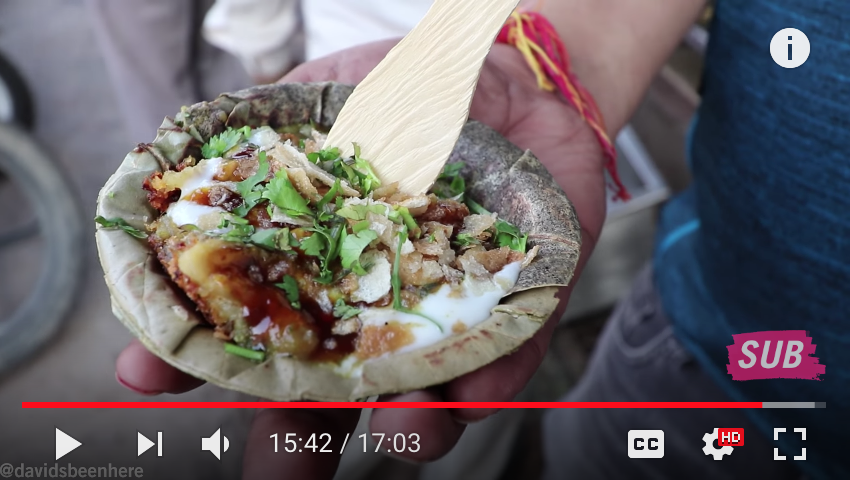


```
15:39 ~ 15:55
食物：tomato chaat
```
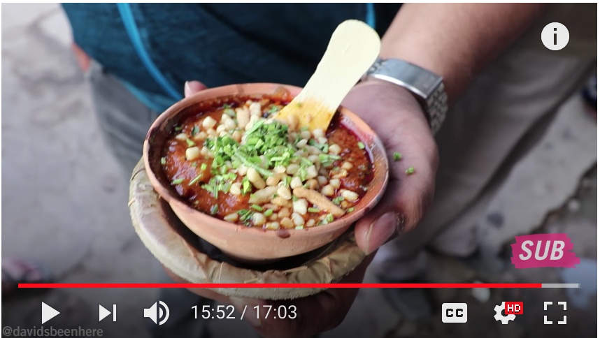
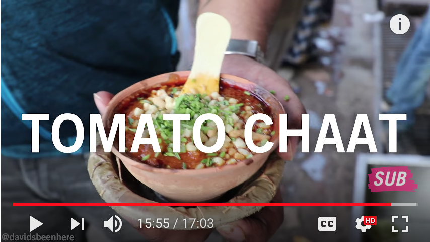


```
15:55 ~ 16:14
食物：chura matar
```

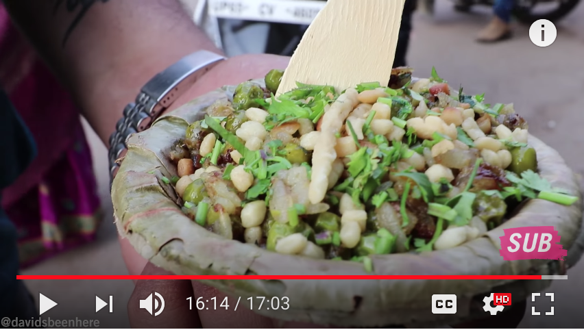


[背包客棧 - [北印]瓦拉那西(Varanasi)](https://www.backpackers.com.tw/forum/showthread.php?t=3962)

# 印度10大不可思議的大小事 ❚ 超級旅行者
[拉肚子](https://youtu.be/yxGm7JG07FU?t=26m33s)

[【印度vlog】Day27-恒河里没有浮尸，有的是活死人](https://www.youtube.com/watch?v=iCGe6BRRIg8)


# useful reference
* [就是要印度](https://yaoindia.com/archives/19730)
* [印度神尤遊印度](https://www.facebook.com/yoyoindia2013/?hc_ref=ARTKaJT-3ESw1_JCXefqP6gtDNt5xc9a_yNnx3ZU4x0YQeHnF-7SdjGQsXfu3FZ4RY4&fref=nf)
* [印度瘋狂 112 天](https://www.youtube.com/watch?v=5jADdZEDt4I&list=PLCh_VulSoFzixrEYvtOQcaicojx02Oy-G&t=0s&index=2)
* [印度 sim 卡](https://www.aerobile.com/eshop/tw/%E5%8D%B0%E5%BA%A6-%E5%A4%A9-%E9%AB%98%E9%80%9F%E4%B8%8A%E7%B6%B2%E5%90%83%E5%88%B0%E9%A3%BD-sim%E5%8D%A1-%28a16%29-p-513.html)
* [印度搭 uber](https://www.backpackers.com.tw/forum/showthread.php?t=1940701)
* [【臺灣人的印度故事】20180422 - 看見印度](https://www.youtube.com/watch?v=BygH-rRqFKU&feature=youtu.be)
